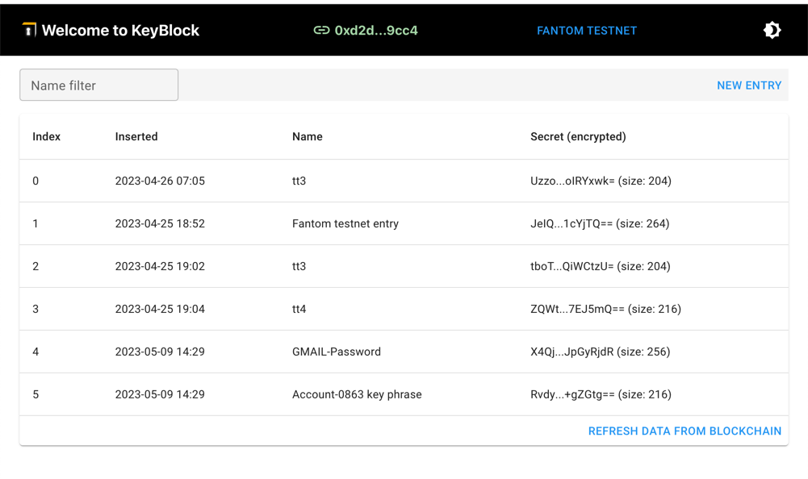
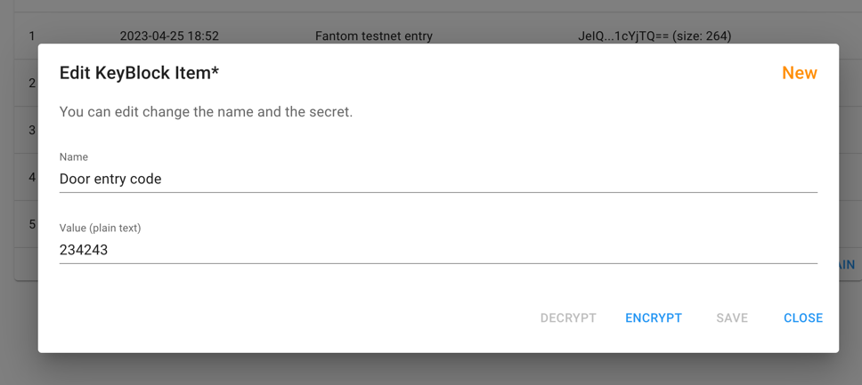
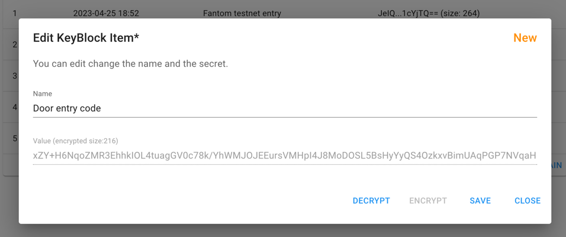
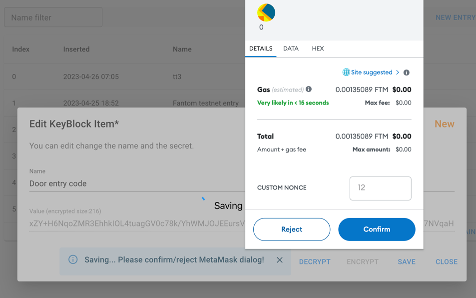
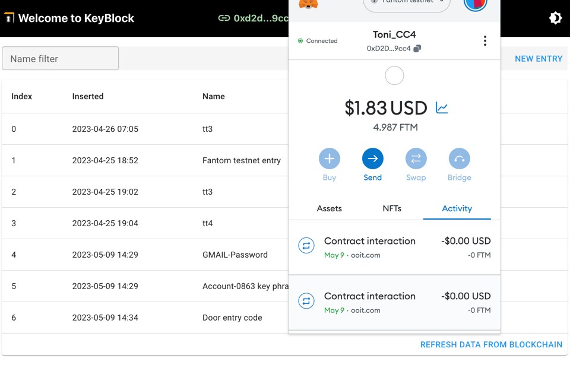

#  Key Block

A safe storage for you secrets:
- Fully encrypted password with your private key
- No storage other than on blockchain
- No unencrypted storage
- On multiple blockchain deployed: Ethereum, Polygon, Fantom
- Testnet: Fantom Testnet

## List of secrets

You have to connect MetaMask with the Dapp.

List of entries (Here using Fantom Testnet):

## Add entry

### New Entry before encryption

### New Entry after encryption

### Save Encrypted Entry

Saving the encrypted Entry need some ETH for the tranaction:

### Waiting till transaction is finished

