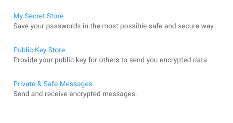

# KeyBlock Web

KeyBlock Web is a ReactJS front end for the following contracts:

## My Secret Store

The following functionality is included:
- Connect to address and network via MetaMask browser extension
- Reading KeyBlock entries from the blockchain (belonging to the address)
- Add new KeyBlock entries
- Update KeyBlock entries
- Encrypt the entry value with the public key of the address
- Decrypt the entry value with the private key of the address
- Only encrypted values are saved to the blockchain

### Deployed

The **My Secret Store** contract is deployed to the following EVM-compatible blockchains main networks:
- Ethereum (Mainnet): 
- Polygon (Mainnet)
- Fantom (Mainnet and Testnet)

For testing the BlockKey contract is deployed to the following test blockchains:
- Polygon Mumbai
- Fantom Testnet
- 

